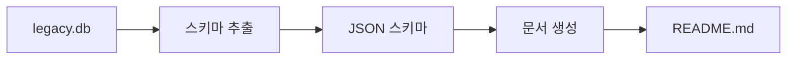
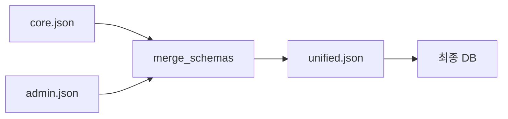

# MCP DB Schema Tools 🛠️

**Claude Code용 데이터베이스 스키마 관리 MCP 서버**

비즈니스 요구사항부터 완성된 데이터베이스까지, 자연어로 간단하게 관리하세요.

---

## 📋 목차

- [🎯 주요 기능](#-주요-기능)
- [⚡ 빠른 시작](#-빠른-시작)
- [🔧 준비사항](#-준비사항)
- [🛠️ 사용 가능한 도구들](#️-사용-가능한-도구들)
- [📖 워크플로우 가이드](#-워크플로우-가이드)
- [🎉 실제 사용 예시](#-실제-사용-예시)
- [🚀 고급 사용법](#-고급-사용법)
- [🔧 개발 가이드](#-개발-가이드)

---

## 🎯 주요 기능

### ✨ **완전한 AI 기반 워크플로우**
```
비즈니스 기획서 → JSON 스키마 → SQL DDL → SQLite 데이터베이스
```

### 🔄 **양방향 변환 지원**
- JSON ↔ SQL 완벽 변환
- 기존 DB → JSON 스키마 추출
- 여러 스키마 파일 병합

### 🤖 **Claude Code와 완벽 통합**
- 자연어로 스키마 관리
- 실시간 검증 및 피드백
- 원클릭 데이터베이스 생성

### 🛡️ **안정성 보장**
- 관계 무결성 자동 검증
- 안전한 시드 데이터 삽입
- 백엔드 모델과 동기화 확인

---

## ⚡ 빠른 시작

### 1️⃣ 설치
```bash
# uv가 없다면 먼저 설치
curl -LsSf https://astral.sh/uv/install.sh | sh

# 프로젝트 설치
cd mcp-db-schema-tools
uv sync

# 설치 확인
uv run python -c "import mcp_db_schema_tools; print('✅ MCP server ready!')"
```

### 2️⃣ Claude Code 설정
`.claude/settings.json`에 다음을 추가:

```json
{
  "mcpServers": {
    "db-schema-tools": {
      "command": "uv",
      "args": [
        "run",
        "--directory",
        "/path/to/mcp-db-schema-tools",
        "python",
        "-m",
        "mcp_db_schema_tools"
      ]
    }
  }
}
```

### 3️⃣ 즉시 사용 가능! 🎉
Claude Code에서 자연어로 요청하세요:

```
"내 기획서로 데이터베이스 스키마 만들어줘"
"이 스키마로 SQLite 파일 생성해줘"
"기존 DB와 백엔드 모델이 동기화되었는지 확인해줘"
```

---

## 🔧 준비사항

### ✅ **필수 요구사항**
- Python 3.8+
- uv (패키지 관리자)
- Claude Code

### 📦 **권장 준비물**
- 비즈니스 요구사항 문서 (`.md`, `.txt` 등)
- 기존 데이터베이스 파일 (선택사항)
- 백엔드 모델 파일 (동기화 확인용, 선택사항)

### 🎯 **지원 데이터베이스**
- ✅ **SQLite** (완전 지원)
- 🚧 **PostgreSQL** (기본 지원)
- 🚧 **MySQL** (기본 지원)

---

## 🛠️ 사용 가능한 도구들

### 🤖 **1. AI 스키마 생성**
```typescript
// 도구명: generate_schema_json_from_text
"이 기획서를 바탕으로 데이터베이스 스키마를 만들어줘"
```
- **입력**: 비즈니스 요구사항 텍스트/문서
- **출력**: 완성된 JSON 스키마
- **특징**: AI가 자동으로 테이블과 관계 분석

### 🔄 **2. JSON → SQL 변환**
```typescript
// 도구명: schema_json_to_sql
"JSON 스키마를 SQLite SQL로 변환해줘"
```
- **입력**: JSON 스키마 파일 또는 내용
- **출력**: 실행 준비된 SQL DDL
- **지원**: SQLite, PostgreSQL, MySQL

### 🗄️ **3. 데이터베이스 생성**
```typescript
// 도구명: create_database_from_schema
"이 스키마로 SQLite 데이터베이스 만들어줘"
```
- **입력**: JSON 스키마
- **출력**: 완성된 SQLite 파일
- **기능**: 시드 데이터 자동 삽입

### 📤 **4. 기존 DB → JSON 추출**
```typescript
// 도구명: extract_schema_from_db
"기존 SQLite 파일에서 스키마를 JSON으로 추출해줘"
```
- **입력**: 기존 데이터베이스 파일
- **출력**: JSON 스키마 + 문서화
- **활용**: 레거시 DB 문서화

### 🔍 **5. 스키마 검증**
```typescript
// 도구명: validate_schema
"이 스키마에 문제없는지 검증해줘"
```
- **검증 항목**: Foreign Key, 인덱스, 데이터 타입
- **결과**: 오류/경고 리스트 + 개선 제안

### 🧩 **6. 스키마 병합**
```typescript
// 도구명: merge_schemas
"core와 admin 스키마를 합쳐줘"
```
- **입력**: 여러 JSON 스키마 파일
- **출력**: 통합된 단일 스키마
- **활용**: 모듈별 스키마 관리

### ⚖️ **7. 모델 동기화 확인**
```typescript
// 도구명: compare_with_models
"현재 DB와 백엔드 모델이 동기화되어 있는지 확인해줘"
```
- **입력**: SQLite DB + Python 모델 파일들
- **출력**: 누락/추가 테이블, 컬럼 차이
- **활용**: 마이그레이션 계획 수립

---

## 📖 워크플로우 가이드

### 🌟 **시나리오 1: 신규 프로젝트 시작**


**Claude Code 명령어 순서:**
1. `"프로젝트 기획서로 데이터베이스 스키마 만들어줘"`
2. `"생성된 스키마 검증해줘"`
3. `"검증된 스키마로 SQLite 데이터베이스 생성해줘"`

### 🔄 **시나리오 2: 기존 DB 문서화**


**Claude Code 명령어 순서:**
1. `"legacy.db에서 스키마를 JSON으로 추출해줘"`
2. `"추출된 스키마로 README 문서 만들어줘"`

### 🔧 **시나리오 3: 팀 협업 (모듈별 개발)**


**Claude Code 명령어 순서:**
1. `"core.json과 admin.json 스키마를 병합해줘"`
2. `"병합된 스키마 검증해줘"`
3. `"최종 스키마로 데이터베이스 생성해줘"`

---

## 🎉 실제 사용 예시

### 🚀 **예시 1: 블로그 플랫폼 프로젝트**
```prompt
사용자: "blog_platform.md 파일의 비즈니스 요구사항으로 데이터베이스 스키마를 만들어줘"

Claude: generate_schema_json_from_text 도구로 스키마를 생성하겠습니다.

✅ Schema generated and saved to: blog_schema.json
📊 Generated Schema Summary:
- Database: blog_platform  
- Tables: 6
- Relationships: 8

📋 Tables Created:
- users: 사용자 정보 (이메일 인증)
- categories: 게시글 카테고리
- posts: 블로그 게시글
- comments: 댓글 시스템
- tags: 태그 관리
- post_tags: 게시글-태그 관계
```

```prompt
사용자: "생성된 스키마로 SQLite 데이터베이스 만들어줘"

Claude: create_database_from_schema 도구로 데이터베이스를 생성하겠습니다.

✅ SQLITE Database created successfully!
📁 Database: blog_platform.db
📊 Tables created: 6
🌱 Seed records inserted: 3

준비 완료! 이제 FastAPI 백엔드 개발을 시작할 수 있습니다.
```

### 🔍 **예시 2: 레거시 DB 분석**
```prompt
사용자: "old_system.db 파일을 분석해서 현대적인 JSON 스키마로 변환해줘"

Claude: extract_schema_from_db 도구로 스키마를 추출하겠습니다.

✅ SQLITE Schema extracted and saved to: legacy_schema.json
📊 Schema Summary:
- Database: old_system
- Tables: 15
- Relationships: 8

⚠️ 발견된 문제점:
- Missing foreign key constraints (3개)
- Inconsistent naming convention
- Missing indexes on frequently queried columns

💡 개선 제안:
- users.email에 UNIQUE 인덱스 추가
- created_at 컬럼들에 기본값 설정
- 외래키 제약조건 추가
```

### ⚖️ **예시 3: 백엔드 동기화 확인**
```prompt
사용자: "현재 데이터베이스가 SQLAlchemy 모델과 동기화되어 있는지 확인해줘"

Claude: compare_with_models 도구로 확인하겠습니다.

🔍 Database vs Models Comparison

❌ Missing Tables in Database (2):
- user_profiles
- activity_logs

⚠️ Extra Tables in Database (1):
- temp_migration_backup

📝 Missing Columns:
- users: last_login_ip, preferences
- orders: tracking_number

💡 Suggestions:
- Create migration script for missing tables
- Remove temporary backup table
- Consider adding missing columns to models
```

---

## 🚀 고급 사용법

### 🎨 **커스텀 스키마 템플릿**
```json
{
  "database": {
    "name": "my_project",
    "type": "sqlite",
    "version": "1.0.0",
    "description": "프로젝트 설명"
  },
  "tables": {
    "users": {
      "description": "사용자 정보",
      "columns": {
        "id": {
          "type": "INTEGER",
          "primary_key": true,
          "auto_increment": true
        }
      }
    }
  }
}
```

### 🔄 **배치 처리**
```bash
# 여러 스키마 파일 일괄 변환
for schema in schemas/*.json; do
  echo "Converting $schema..."
  # Claude Code에서 자동화 가능
done
```

### 🧪 **테스트 데이터 생성**
```json
{
  "seed_data": {
    "users": [
      {
        "id": 1,
        "email": "test@example.com",
        "name": "테스트 사용자"
      }
    ]
  }
}
```

---

## 🔧 개발 가이드

### 📦 **개발 환경 설정**
```bash
# 개발 의존성 포함 설치
uv sync --dev

# 코드 품질 검사
uv run black .
uv run ruff check .

# 테스트 실행
uv run pytest -v

# MCP 서버 디버그 모드
uv run python -m mcp_db_schema_tools --debug
```

### 🧪 **테스트 작성**
```python
def test_schema_generation():
    """비즈니스 요구사항에서 스키마 생성 테스트"""
    requirements = "사용자 관리 시스템..."
    schema = generate_schema_from_text(requirements)
    assert "users" in schema["tables"]
```

### 📋 **기여 방법**
1. **Fork** this repository
2. **Branch** 생성: `git checkout -b feature/amazing-feature`
3. **Commit** 변경사항: `git commit -m 'Add amazing feature'`
4. **Push** to branch: `git push origin feature/amazing-feature`
5. **Pull Request** 생성

### 🐛 **이슈 리포트**
문제 발견 시 다음 정보와 함께 GitHub Issues에 보고해주세요:
- MCP 서버 버전
- Claude Code 버전
- 오류 메시지
- 재현 단계

---

## 📄 라이선스

MIT License - 자세한 내용은 [LICENSE](LICENSE) 파일을 참조하세요.

---

## 🙏 감사의 말

이 프로젝트는 다음 기술들로 만들어졌습니다:
- ⚡ **uv** - 초고속 Python 패키지 관리
- 🤖 **Claude Code** - AI 기반 개발 환경
- 🔗 **MCP Protocol** - 모델-컴퓨터 간 통신

---

**Made with ⚡ uv and ❤️ for Claude Code integration**

> 💡 **팁**: 이 README도 MCP DB Schema Tools로 관리되는 프로젝트의 데이터베이스를 바탕으로 작성되었습니다!